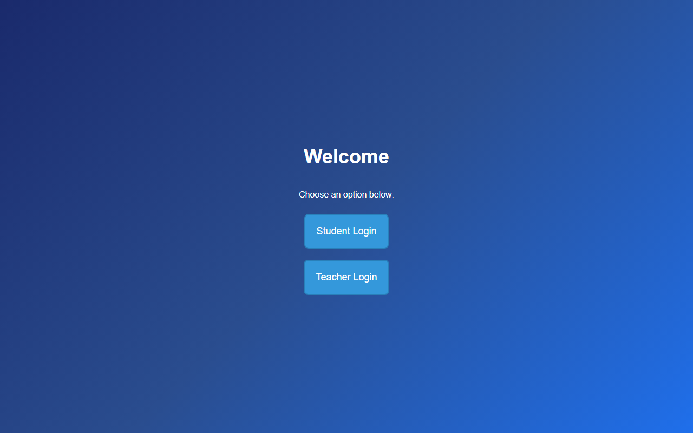
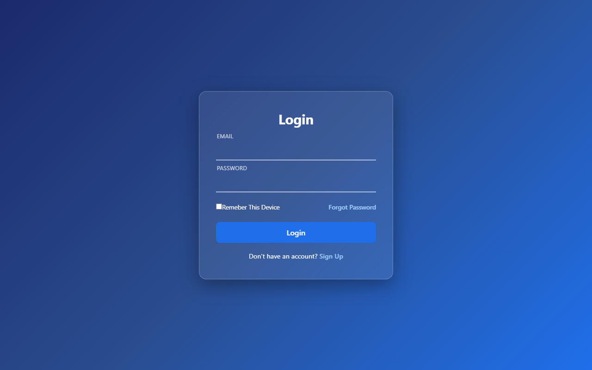
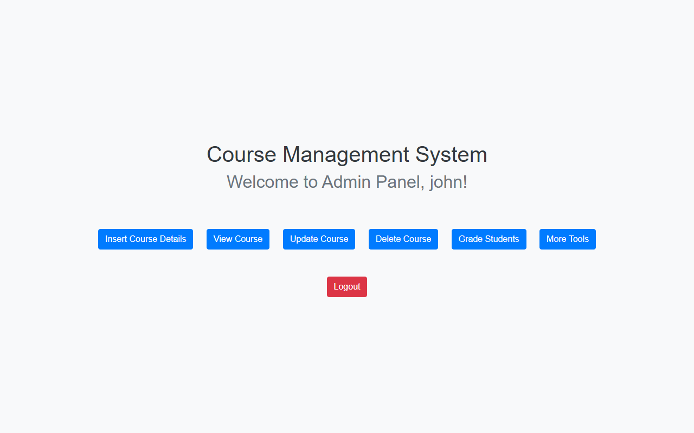
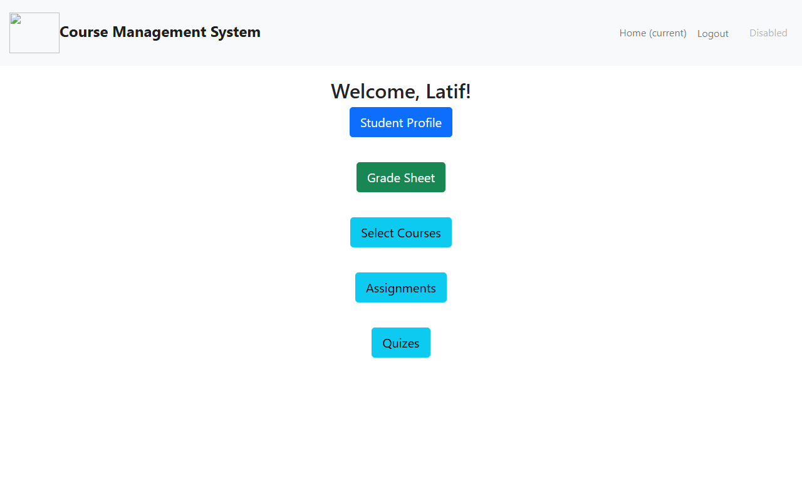
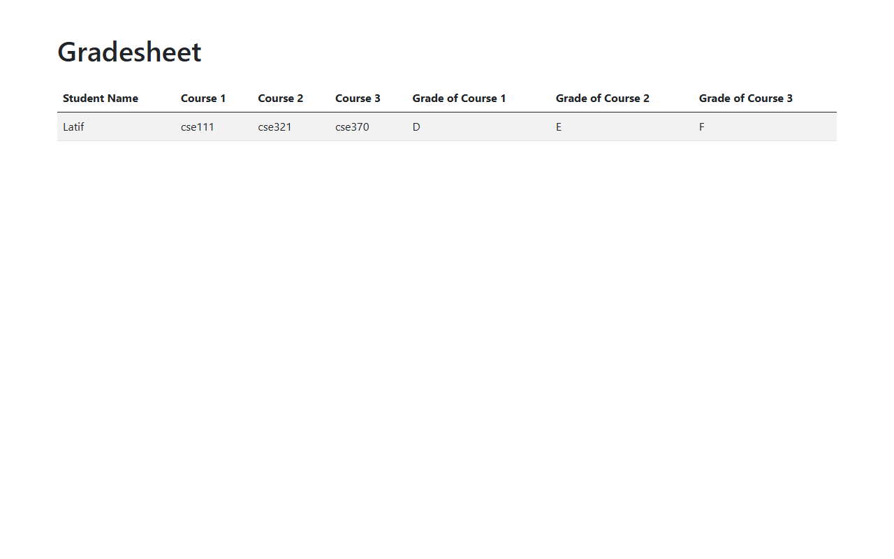

# Course Management System

[](https://github.com/SummitAnthony/CSE370-Project/actions/workflows/ci.yml)
[](LICENSE)


A web-based course management system with separate **teacher** and **student** portals — course CRUD, assignment/quiz uploads, and grading — built on PHP and MySQL. Originally developed for BRAC University's CSE370 (Database Systems) course, then modernized: SQL-injection-free prepared statements everywhere, bcrypt password hashing, a one-command Docker setup, and CI that guards it all.

<p align="center">
  
</p>

## Quick start

```bash
git clone https://github.com/SummitAnthony/CSE370-Project.git
cd CSE370-Project
docker compose up
```

Open **http://localhost:8080/welcome.php** — the database schema and demo data import automatically.

| Demo account | Email | Password |
| --- | --- | --- |
| Teacher | `john@gmail.com` | `password123` |
| Student | `latif@gmail.com` | `password123` |

<details>
<summary>Running without Docker (XAMPP/WAMP)</summary>

1. Import `database/370project.sql` into MySQL.
2. Serve the `public/` directory (e.g. point your Apache docroot at it).
3. Configure the DB connection via environment variables (see `.env.example`) — defaults assume `root` with no password on `localhost`.

</details>

## Features

| Teacher portal | Student portal |
| --- | --- |
| Create, view, update, and delete courses | Sign up and manage a profile |
| Upload assignment and quiz PDFs per course | Select courses |
| Grade each student's three courses | View the gradesheet for all selected courses |
|  | Download assignment and quiz files |

## Screenshots

| Student login | Teacher dashboard |
| --- | --- |
|  |  |

| Student home | Gradesheet |
| --- | --- |
|  |  |

## Database design

The schema (six tables — course catalog, two account tables, course selections/grades, and per-course assignment and quiz uploads) is documented with a full entity-relationship diagram in **[docs/er-diagram.md](docs/er-diagram.md)**.

## Architecture

```
public/            # web docroot — one PHP page per screen/action
  css/             # stylesheets
  assignments/     # uploaded assignment PDFs (runtime)
  uploads/         # uploaded quiz PDFs (runtime)
includes/db.php    # single DB bootstrap, configured via environment variables
database/          # MySQL schema + seed data (auto-imported by Docker)
.github/workflows/ # CI: PHP lint + SQL-injection gate
```

## Security highlights

- **Prepared statements everywhere** — every query touching user input uses bound parameters; CI fails any commit that interpolates request input into a SQL string.
- **bcrypt password hashing** — `password_hash()` / `password_verify()`, with `session_regenerate_id()` on login.
- **Environment-based configuration** — no credentials hardcoded in the codebase.

## Credits

Built by [Summit Anthony](https://github.com/SummitAnthony) and [Ahanaf Tanvir](https://github.com/ahanaftanvir40). MIT licensed.
