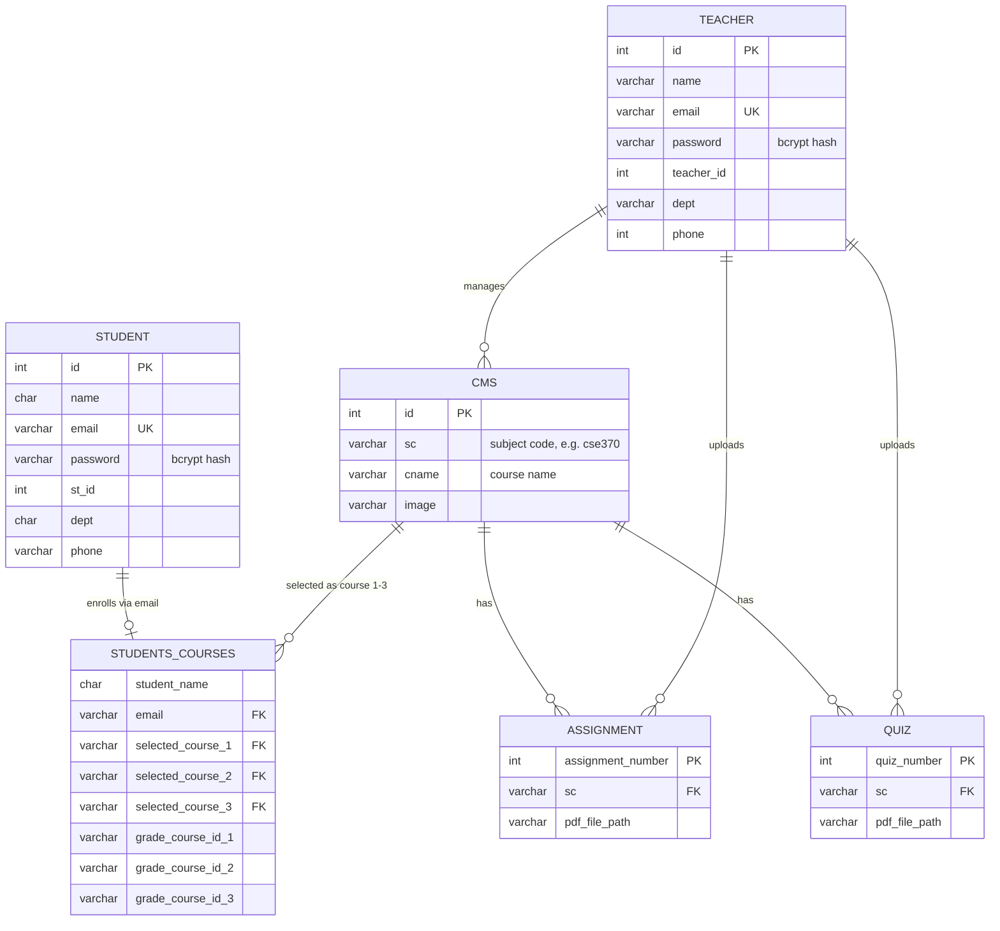

# Entity-Relationship Diagram

The database (`370project`) has six tables. Relationships are enforced at the
application level (the original schema declares no foreign keys): courses are
referenced by their subject code `sc`, and a student's course selections and
grades live in `students_courses`, keyed by the student's email.

## Table roles

| Table | Role |
| --- | --- |
| `cms` | Course catalog (subject code, name, cover image) |
| `student` / `teacher` | Account records for the two roles |
| `students_courses` | A student's three selected courses and the grade for each |
| `assignment` / `quiz` | Uploaded PDF materials attached to a course by subject code |
